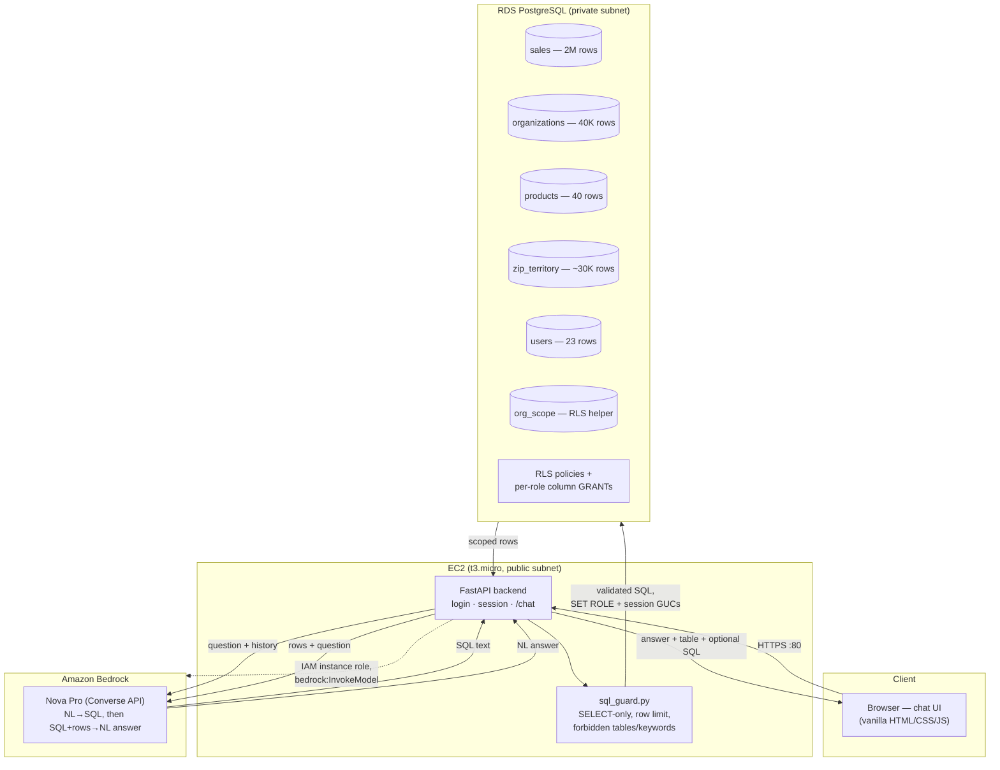

# DESIGN.md

## Architecture

Two Bedrock calls per turn: one to generate SQL (system prompt = domain knowledge +
few-shot examples + the user's role/scope), one to turn the executed result set into a
natural-language answer. Conversation history (last 6 exchanges) is replayed to Bedrock
so follow-ups ("now break that down by quarter") have context — kept in-memory per
session for this demo (see Trade-offs).

## Database choice: PostgreSQL

The assignment allows any SQL database; SQLite (the schema's stated `-- Target:
SQLite` comment) or MySQL were the alternatives actually considered.

- **Row-level security is a first-class Postgres feature.** The security model
  ("RAMs see only their territory, Directors only their region, WAC hidden from
  non-Exec") maps directly onto Postgres RLS policies plus per-column `GRANT`/`REVOKE`
  — both enforced by the database itself, independent of anything the LLM generates.
  SQLite has no concept of database roles or RLS; that enforcement would have to live
  entirely in the application layer, which is a weaker guarantee for exactly the
  requirement the assignment weights most ("Security... enforced at the DATABASE
  level, not only in the prompt").
- **2M+ row concurrent workload.** A single SQLite file does not support concurrent
  writers well and has no native connection-level privilege separation; Postgres
  handles the full dataset with straightforward indexing and was the natural fit for
  RDS deployment.
- MySQL also has RLS-adjacent options but nothing as mature/native as Postgres policies,
  and Postgres's `SECURITY DEFINER`/session-GUC idioms are well-documented for exactly
  this "one shared app connection, many logical tenants" pattern.

## Domain knowledge integration

Every fact in `docs/*.md` that affects query correctness was distilled into
`backend/app/prompts.py` as the system prompt sent on every turn:

- **`DOMAIN_RULES`** — a condensed rulebook covering the three `data_source` meanings
  (distributor = paid demand, hub_dispense = free drug excluded by default, market_data
  = the market-share denominator), the market share formula (distributor numerator /
  market_data denominator, `NULLIF` for zero-denominator → NULL not 0), the
  grandparent-level account rollup with `COALESCE` for standalone facilities, the
  territory/region join path, and the offset-based time filters (`mo_offset`/`wk_offset`,
  R3M = `IN (0,1,2)`).
- **Few-shot examples** (`FEWSHOT_COMMON`, `FEWSHOT_EXEC`, `FEWSHOT_NON_EXEC`) — real
  question→SQL pairs drawn from the patterns in `docs/account_analytics.md` and
  `docs/product_analytics.md` (top-N accounts, market share, trend over time, hub-dispense
  volume, 340B filtering, hospital-vs-clinic comparison), plus role-specific examples
  showing the volume-substitution pattern for non-Exec revenue questions.
- **Per-role prompt variation** — the system prompt is built per request
  (`build_system_prompt(role, ...)`) so a Director/RAM's prompt explicitly states they
  have no WAC access and must never generate a query touching it, while an Exec's prompt
  states the opposite. This doesn't replace the database enforcement (see Security below)
  — it reduces wasted turns where the model tries a WAC query only to have it rejected.
- The schema itself is summarized compactly (`SCHEMA_SUMMARY`) rather than pasted
  verbatim from `create_tables.sql`, keeping token cost down while preserving every
  column name the model needs.

## LLM provider and prompt design

**Amazon Bedrock**, via `boto3`'s `bedrock-runtime` Converse API (`backend/app/bedrock.py`),
model selected by the `BEDROCK_MODEL_ID` env var (defaults to `amazon.nova-pro-v1:0`) so
swapping providers/models is a config change, not a code change — the Converse API and the
rest of `bedrock.py` are provider-agnostic.

**Model choice: Amazon Nova Pro, not Anthropic Claude.** Claude was the original choice and
the code was written/tested against it (see the Blockers Log) — `sonnet-4-5` via Bedrock's
`us.*` cross-region inference profile generated correct SQL in manual testing. But once real
AWS credentials were in place, every `Converse` call against the Anthropic models on this
account failed with `AccessDeniedException: ... not authorized to perform the required AWS
Marketplace actions (aws-marketplace:ViewSubscriptions, aws-marketplace:Subscribe) ...`. This
persisted identically for both the deploying IAM user (which has full `AdministratorAccess`,
ruling out an IAM permissions gap) and the EC2 instance role, and recurred on retry after the
5+ minutes AWS's own error message suggests waiting — pointing to an account-level Marketplace
entitlement restriction (common on new/free-tier accounts) rather than anything fixable in this
repo's IAM policy or code. Amazon Nova Pro is a first-party Bedrock model fulfilled directly by
AWS rather than through an AWS Marketplace listing, works on-demand (no inference profile
needed), and hit none of these issues. `infra/iam.tf` authorizes both `anthropic.*` and
`amazon.nova*` model/inference-profile ARNs, so switching back to Claude once/if the Marketplace
restriction clears is just a `BEDROCK_MODEL_ID` change.

Two calls per turn, deliberately kept separate:

1. **`generate_sql`** — system prompt (domain rules + few-shot + role/scope) + replayed
   history + the new question → raw SQL text only, `temperature=0` for determinism. If
   the model can't answer from this schema it returns `NO_QUERY: <reason>` instead of
   forcing a query.
2. **`generate_answer`** — given the question, the SQL that ran, and up to 50 result
   rows, produces the natural-language response the user actually reads, at
   `temperature=0.2` for more natural phrasing. This call also receives an `access_note`
   (e.g. "pricing/WAC data isn't available at this level") the app computes heuristically
   from the question text, so the model can explain *why* it substituted volume for
   revenue instead of silently doing so.

Splitting these two calls (rather than one call that both writes SQL and phrases the
answer) keeps the SQL-generation prompt focused purely on schema/domain correctness and
keeps the answer prompt focused purely on tone/clarity — each system prompt stays smaller
and more reliable than one prompt trying to do both jobs.

## Security implementation

Layered, with the database as the authority — the application-layer checks exist to
fail fast and produce friendly errors, not because they're trusted alone.

1. **Authentication**: `users.password_hash` (bcrypt), a signed session cookie
   (`itsdangerous`/Starlette `SessionMiddleware`) stores only `user_id` — never role or
   scope — so tampering with the cookie can't escalate access even before signature
   verification is considered; every request re-reads the authoritative row from
   `users` via a connection with no analytics privileges at all.
2. **Row-level security** (`db/02_security.sql`): `sales` and `organizations` have RLS
   policies keyed off session GUCs (`app.current_role`/`app.current_territory`/
   `app.current_region`) that the backend sets via `SET LOCAL`/`set_config()` at the
   start of each request's transaction, sourced from the authenticated user's DB row —
   never from the request body or the LLM's output. `app_exec` carries `BYPASSRLS`.
3. **Column-level security (WAC)**: `app_director`/`app_ram` are never `GRANT`ed
   `SELECT` on `sales.wac` — not even implicitly via `SELECT *`, which Postgres rejects
   with a column-privilege error just like an explicit `SELECT wac` would. Verified
   directly in `tests/test_db_security.py::test_select_star_denied_because_it_includes_wac`.
4. **`users` table isolation**: none of `app_exec`/`app_director`/`app_ram` — the roles
   under which every LLM-generated query executes — are granted anything on `users`.
   Even a successfully prompt-injected `SELECT * FROM users` fails at the database
   regardless of role, verified in
   `test_db_security.py::test_users_table_unreachable_by_every_analytics_role`.
5. **Least privilege by default**: the base login role (`app_login`) is granted the
   three tier roles `WITH INHERIT FALSE` — a code path that forgets to `SET ROLE`
   fails closed (no privileges) rather than open.
6. **Application-layer SQL validation** (`sql_guard.py`): SELECT/CTE-only, single
   statement, blocklist of DDL/DML/admin keywords, blocked table references
   (`users`, `pg_catalog`, `information_schema`), a non-exec `wac` check duplicating the
   DB's own enforcement, and an auto-appended `LIMIT 500` when the model didn't include
   one.
7. **Statement timeout**: `SET LOCAL statement_timeout` (default 8s) per scoped
   transaction, defending against a runaway or accidentally-cartesian generated query.
8. **Revenue → volume substitution**: a lightweight keyword heuristic
   (`_access_note` in `main.py`) detects revenue-flavored questions from non-Exec users
   and asks the answer-generation call to explain the substitution, rather than
   silently returning units with no context.
9. **Per-user rate limit**: 60 `/chat` requests/hour, a sliding window keyed by
   `user_id` (`_rate_limit_ok` in `main.py`), checked before any Bedrock call — caps both
   brute-force-style abuse of the shared demo login and per-user Bedrock spend. In-memory
   like `_conversations`, so the same caveat applies (see trade-offs below).

See `tests/test_db_security.py` for the tests that exercise every one of these directly
against the live database (not mocked), and `tests/test_llm_security_and_edge_cases.py`
for the same guarantees exercised through real chat turns including prompt-injection
attempts.

## AWS services used

| Service | Why |
|---|---|
| **RDS PostgreSQL** (`db.t4g.micro`, single-AZ, private subnet) | Free-tier-eligible; RLS/grants as above |
| **EC2** (`t3.micro`, public subnet) | Runs the Dockerized FastAPI app; free-tier-eligible |
| **Elastic IP** | Attached to the app instance so the public URL is stable across EC2 replacements — this build replaced the instance several times to pick up fixes, and the URL changed every time before this was added |
| **Bedrock** (Amazon Nova Pro, Converse API) | NL→SQL + answer generation — see "Model choice" above for why Nova over Claude |
| **IAM instance role** | `bedrock:InvokeModel(WithResponseStream)` scoped to `anthropic.*` and `amazon.nova*` foundation models/inference-profiles, plus SSM Session Manager (no SSH key / open port 22 needed) |
| **VPC** (2 AZ, public+private subnets, **no NAT Gateway**) | RDS never initiates outbound connections, so a NAT Gateway (~$32/mo) was cut entirely — EC2 gets its own public IP for outbound pulls |
| **AWS Budgets** | Monthly cost budget with 80%/100% email alerts |

Full Terraform in `infra/`; see README.md for `terraform apply` steps.

## Trade-offs and what I'd improve with more time

- **In-memory conversation history and rate-limit state** (`_conversations` and
  `_chat_request_times` dicts in `main.py`) are lost on app restart and don't scale past
  one instance. A real deployment would move both to Redis or a `sessions` table.
- **Demo auth is a single shared password** for all 23 seeded users (bcrypt-hashed,
  Terraform-generated, never hardcoded) rather than per-user credentials or SSO — the
  assignment's `users` table ships with no password column at all, so *some* convention
  had to be invented; this is the simplest one that still goes through a real
  bcrypt-verified login flow rather than a fake "pick your role" dropdown.
- **RLS trade-off documented in `db/02_security.sql`**: `org_scope` (org_id →
  territory/region only, no sales or pricing data) is directly readable by
  `app_director`/`app_ram` rather than hidden behind a `SECURITY DEFINER` function. The
  function-based version was tried first specifically to prevent a RAM from enumerating
  every territory name in the company; it was reverted after it caused a full-table
  scoped query to exceed the 8-second statement timeout, because Postgres cannot inline
  `SECURITY DEFINER` functions into the query plan. Given more time, a materialized,
  indexed **security-barrier view** might recover the stricter hiding without the
  per-row function-call cost — untested here.
- **SQL validator is regex/keyword-based**, not a real SQL parser. It catches the
  realistic threats (stacked statements, DDL/DML keywords, forbidden table names) but
  isn't a formal guarantee the way the database-level RLS/grants are — which is exactly
  why those are the primary control and this is explicitly the secondary one.
- **Row limit (500) is appended textually**, not parsed/injected into the query's actual
  outer scope — for a query already ending in a subquery/CTE this is correct, but a
  hand-crafted adversarial query with trailing comments could in principle confuse the
  regex-based `LIMIT` detector. A real SQL AST parser (e.g. `sqlglot`) would close this
  gap.
- **Secrets on EC2** land in a `.env` file written by `user_data` (readable by anyone
  with EC2 describe-instance-attribute access to that account) rather than pulled at
  runtime from Secrets Manager/SSM Parameter Store — acceptable for a scoped take-home,
  not for production.
- **No autoscaling / load balancer** — a single EC2 instance is the whole compute layer.
  Fine for a demo; would move to ECS Fargate + ALB + RDS Multi-AZ for anything real.
- **Bedrock model access and AWS credentials were the two hard blockers** for this
  submission — see PLAN.md's blockers log for exact status and what's needed to unblock.
